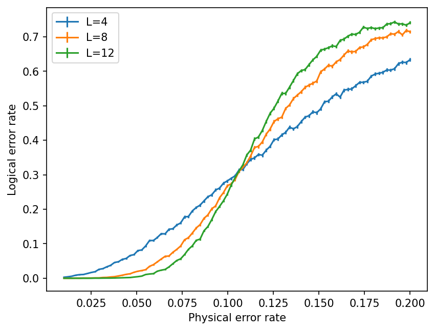

# Toric code threshold plot

Monte Carlo estimate of the toric code accuracy threshold under
code-capacity noise.

**Setup.** Independent Z errors at rate p on each of the 2L^2 qubits;
perfect syndrome measurement. X (site) stabilisers only; the X and Z
sectors decouple, so one sector carries the whole story. Decoding by
minimum-weight perfect matching (PyMatching/sparse blossom), with edge
weight log((1-p)/p). A shot fails when the residual chain E + C is a
homologically non-trivial cycle, detected by comparing its parities
against the two logical representatives.

**Result.** Sweeping p ∈ [0.01, 0.20] at L = 4, 8, 12 with 10000 shots
each, the curves cross at p ~ 10%. The accuracy threshold is defined as the critical value of physical error rate p where logical error rate starts to grow with L instead of falling exponentially. This is why, the crossing point is the threshold. 

**Caveat.** This is the MWPM threshold, not the optimal one. Matching
returns the single most likely error chain, whereas maximum-likelihood
decoding would sum over all chains in a homology class; the latter
gives ≈ 10.9% (the Nishimori point of the 2D random-bond Ising model).

**Run.** `pip install -r requirements.txt`, then open `threshold.ipynb`.

